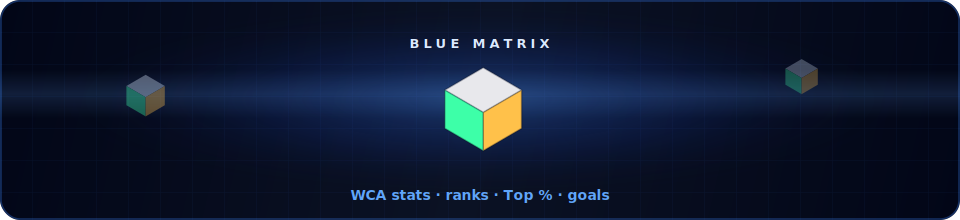
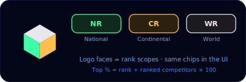
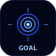
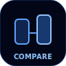
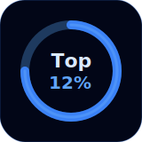
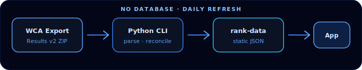
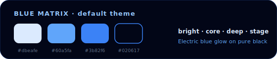
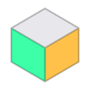
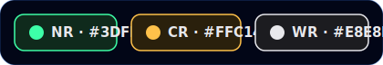
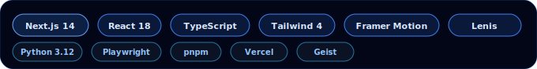

<p align="center">
  
</p>

<p align="center">
  
</p>

<p align="center">
  <strong>WCA stats analyzer</strong> for speedcubers — ranks, Top %, goals, compare, and country stats.<br/>
  Official WCA data · no database · static JSON on the <code>rank-data</code> branch.
</p>

<p align="center">
  
</p>

<p align="center">
  
</p>

## What is Cubify?

Look up any official **WCA ID** and get an easy-to-read speedcubing profile: personal records, national / continental / world ranks, and mathematically correct **Top X%** labels.

Everything else builds on that same accurate dataset — goal simulation, head-to-head compare, and country populations.

<p align="center">
  
</p>

<p align="center">
  
</p>

## Features

### Pages

<p align="center">
  
  &nbsp;
  
  &nbsp;
  
  &nbsp;
  
  &nbsp;
  
</p>

| | Route | Feature | Description |
| :---: | --- | --- | --- |
|  | `/` | **Lookup** | WCA ID → name, country, avatar, PRs, NR/CR/WR ranks, Top % rings |
|  | `/goal` | **Goal simulator** | Result → predicted NR/CR/WR · reverse (target rank or Top % → required result) |
|  | `/compare` | **Compare** | Side-by-side two cubers — times, ranks, facelet-style winners |
|  | `/countries` | **Countries** | Country cuber totals — search, virtualized list, chart views |
|  | `/settings` | **Settings** | Theme families, custom cursor on/off, smooth scroll on/off |

<p align="center">
  
</p>

### Stats & accuracy

<p align="center">
  
</p>

- Official **WCA person API** for identity, avatar, and personal records  
- Ranked-competitor totals from the official **WCA Results Export v2**  
- Only people with a **valid ranked result** count (not every registered account)  
- **Top %** = `rank ÷ ranked competitors × 100`  
- If a live rank is newer than the totals snapshot, the % is **hidden** (never faked)  
- Daily GitHub Action refreshes data when the WCA export date changes  
- No SQL · no paid backend · compact rank-list shards for Goal  

<p align="center">
  
</p>

### Product / UX

- Dark glass editorial UI (Space Grotesk + Geist)  
- **Custom cube brand SVG** (WR · NR · CR faces)  
- **Facelet badges** for NR / CR / WR (same colors as the logo)  
- **Theme system** — 7 color families × 3 shades (Lighter / Darker / Deep)  
- **Custom cursor** + **Lenis smooth scroll** (Settings toggles)  
- Motion: count-up stats, floating theme cube, glass sheen, percentile rings  
- Loading / error / 404 pages wired in App Router  

<p align="center">
  
</p>

## Brand & Blue Matrix

Default theme: **Blue Matrix** (`blue`) — electric blue glow on pure black.

| Token | Hex | Role |
| --- | --- | --- |
| Bright | `#dbeafe` | Highlights, labels |
| Glow | `#60a5fa` | Borders, secondary glow |
| Core | `#3b82f6` | Primary accent |
| Sky | `#38bdf8` | Accents / charts |
| Deep | `#1d4ed8` | Depth rings |
| Stage | `#020617` | Background |

<p align="center">
  
</p>

### Cube mark

<p align="center">
  
</p>

Isometric cube — each face is a ranking scope:

| Face | Scope | Color | Hex |
| --- | --- | --- | --- |
| **Top** | WR (World) | Silver | `#E8E8EC` |
| **Left** | NR (National) | Emerald | `#3DFFA8` |
| **Right** | CR (Continental) | Amber | `#FFC14A` |

```svg
<!-- paths from CubeLogo.tsx (viewBox 0 0 32 32) -->
<path d="M16 3L28 10L16 17L4 10L16 3Z" fill="#E8E8EC"/> <!-- WR top -->
<path d="M4 10L16 17V29L4 22V10Z" fill="#3DFFA8"/>     <!-- NR left -->
<path d="M16 17L28 10V22L16 29V17Z" fill="#FFC14A"/>   <!-- CR right -->
```

```tsx
import { CubeLogo, CubeWordmark } from "@/components/brand/CubeLogo"

<CubeLogo size={28} />
<CubeWordmark />
```

### Facelets

<p align="center">
  
</p>

| Class | Scope | Fill |
| --- | --- | --- |
| `.facelet-nr` | National | Emerald `#3DFFA8` |
| `.facelet-cr` | Continental | Amber `#FFC14A` |
| `.facelet-wr` | World | Silver `#E8E8EC` |

### SVG kit (`docs/brand/`)

All graphics use the Blue Matrix palette (`#020617` stage · `#3b82f6` / `#60a5fa` glow).

| File | What |
| --- | --- |
| `hero-banner.svg` | Full-width matrix grid + cube hero |
| `cubify-wordmark.svg` | Logo + wordmark card |
| `cubify-cube.svg` | Isometric cube mark |
| `cubify-facelets.svg` | NR / CR / WR chips |
| `badge-row.svg` | Feature pill strip |
| `divider.svg` | Section divider with glow node |
| `matrix-grid.svg` | Thin grid band |
| `icon-lookup.svg` | Lookup page icon |
| `icon-goal.svg` | Goal page icon |
| `icon-compare.svg` | Compare page icon |
| `icon-countries.svg` | Countries page icon |
| `icon-settings.svg` | Settings page icon |
| `percentile-ring.svg` | Top % ring mock |
| `rank-scopes.svg` | Cube + NR/CR/WR map |
| `data-pipeline.svg` | Export → CLI → rank-data → app |
| `theme-swatches.svg` | Blue Matrix swatches |
| `stack-pills.svg` | Tech stack chips |
| `footer-glow.svg` | Footer cube + glow |

Also served: [`public/cubify-cube.svg`](public/cubify-cube.svg) → `/cubify-cube.svg`

In-app source of truth: [`components/brand/CubeLogo.tsx`](components/brand/CubeLogo.tsx)

Other custom graphics in code: `PercentileRing` (SVG motion), `FloatingThemeCube`, theme CSS variables.

`public/placeholder-*.svg|png|jpg` are generic leftovers — not brand.

<p align="center">
  
</p>

## Themes (`/settings`)

Dark-stage only (brighter vs deeper glow on black — not light mode).

| Family | Lighter | Darker | Deep |
| --- | --- | --- | --- |
| **Blue** (default) | Blue Pastel | **Blue Matrix** | Midnight Core |
| **Green** | Mint Pastel | Emerald Circuit | Forest Link |
| **Pink** | Sakura Pastel | Neon Sakura | Rose Void |
| **Violet** | Lavender Pastel | Violet Nebula | Ion Shadow |
| **Orange** | Peach Pastel | Solar Core | Ember Pit |
| **Purple** | Lilac Pastel | Royal Pulse | Grape Depth |
| **Night** | Tokyo Pastel | Tokyo Night | Tokyo Deeper |

Stored in `localStorage` as `cubify-theme`. Legacy id `dark-blue` still resolves.

Prefs: `cubify-custom-cursor` · `cubify-smooth-scroll` (both default on).

<p align="center">
  
</p>

## Data sources

| Data | Source |
| --- | --- |
| Person, PRs, live ranks | [WCA person API](https://www.worldcubeassociation.org/) |
| Ranked totals + rank lists | Official **WCA Results Export v2** |
| Country populations | Same export → `country-totals.json` |

Publication branch: **`rank-data`**

```text
rank-totals.json
country-totals.json
rank-lists/{event}/{single|average}.json
```

Reconciliation before publish:

```text
world total = sum of country totals
world total = sum of continent totals
```

Failed validation keeps the previous JSON as last-known-good.

<p align="center">
  
</p>

## Repo layout

```text
app/                         Lookup · Goal · Compare · Countries · Settings
components/
  brand/CubeLogo.tsx         Custom isometric cube SVG + wordmark
  layout/SiteChrome.tsx      Sticky nav island + footer
  motion/                    CountUp · CustomCursor · FloatingThemeCube · GlassSheen · SmoothScroll
  theme/CubifyThemeProvider  Theme families → CSS vars
  PercentileRing.tsx         Top % SVG ring
  ui/                        shadcn primitives + editorial fields
docs/brand/                  README SVG kit (Blue Matrix)
lib/
  cubify-themes.ts           Theme catalog
  cubify-prefs.ts            Cursor / scroll prefs
  wca-*.ts                   Person, totals, rank lists, countries, format
public/cubify-cube.svg       Public brand mark
tests/ · e2e/                Unit + Playwright
tools/wca-rank-totals/       Python 3.12 export → JSON
.github/workflows/           Daily validation + publish
```

## Development

```bash
pnpm install
pnpm dev            # Next.js via scripts/run-next.cjs
pnpm test           # unit / contract tests
pnpm test:e2e       # Playwright
pnpm test:website   # unit + Python generator + tsc + e2e
pnpm build
```

Python pipeline (`tools/wca-rank-totals`):

```bash
PYTHONPATH=src python -m unittest discover -s tests -v
PYTHONPATH=src python -m wca_rank_totals.cli
```

### Gitignored local clutter

| Path | What |
| --- | --- |
| `.next/`, `.next-e2e/` | Next build / e2e caches |
| `.next-dev*.log`, `*.log` | Dev process logs |
| `test-results/`, `playwright-report/` | Playwright artifacts |
| `*.tsbuildinfo` | TS incremental cache |
| `node_modules/`, `__pycache__/` | Dependencies / bytecode |

## Stack

<p align="center">
  
</p>

- **Next.js 14** (App Router) · **React 18** · **TypeScript**  
- **Tailwind CSS v4** · **Framer Motion** · **Lenis**  
- **Geist** + **Space Grotesk**  
- **pnpm** · **Playwright** · **tsx** tests  
- **Python 3.12** stdlib-only WCA export pipeline  
- **Vercel Analytics**  

---

## Attribution

Competition results are owned and maintained by the [World Cube Association](https://www.worldcubeassociation.org/).  
**Cubify is an independent project and is not an official WCA service.**

<p align="center">
  
</p>
